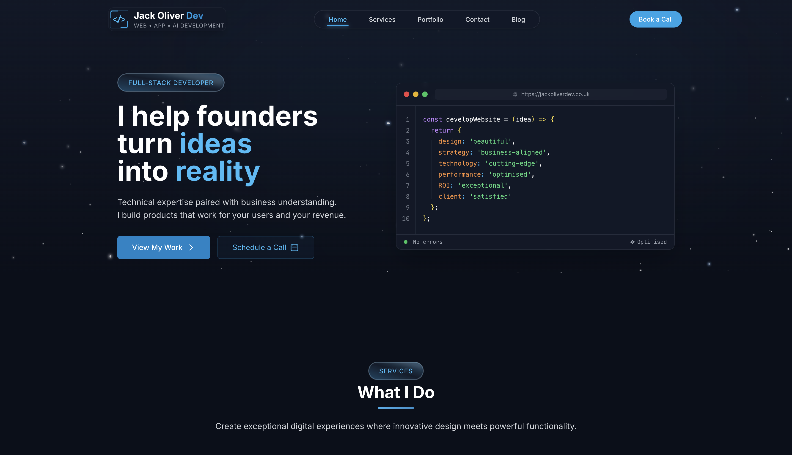

# Jack Oliver Portfolio Website

<p align="center">
  
</p>

## 👋 Hello, I'm Jack Oliver

I'm a web developer based in London, specialising in creating exceptional digital experiences with cutting-edge web, app, and AI development solutions. My focus is on delivering clean, efficient, and user-friendly applications that help businesses grow online.

## 🚀 About This Project

This repository contains the code for my personal portfolio website. I've built it using React and modern web technologies to showcase my work, skills, and services. Feel free to use it as inspiration for your own portfolio!

## 💻 Technologies Used

- React
- JavaScript (ES6+)
- Tailwind CSS
- Framer Motion
- React Router

## ✨ Features

- Responsive design
- Modern UI with animations
- Portfolio showcases
- Blog functionality
- Contact forms
- Service descriptions

## 🛠️ Installation & Setup

If you'd like to run this project locally:

```bash
# Clone the repository
git clone https://github.com/jackoliverdev/jack-oliver-dev.git

# Move into the directory
cd jack-oliver-dev

# Install dependencies
npm install

# Start the development server
npm start
```

The page will open at [http://localhost:3000](http://localhost:3000) in your browser.

## 🧪 Available Scripts

- `npm start` - Runs the app in development mode
- `npm test` - Launches the test runner
- `npm run build` - Builds the app for production

## 📞 Contact Me

Feel free to reach out if you have any questions or would like to work together!

- Email: hello@jackoliver.dev
- Website: [jackoliver.dev](https://jackoliver.dev)
- LinkedIn: [linkedin.com/in/jackoliver](https://linkedin.com/in/jackoliver)

## 📄 Licence

This project is open source and available under the [MIT Licence](LICENCE).
